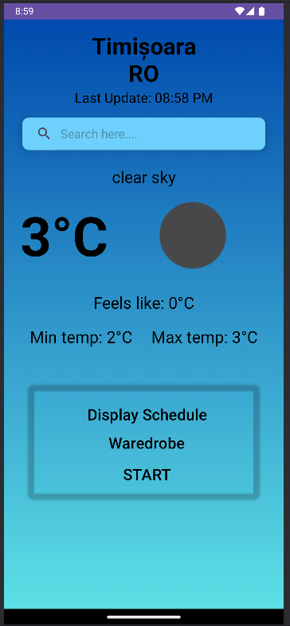
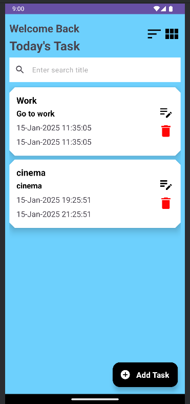
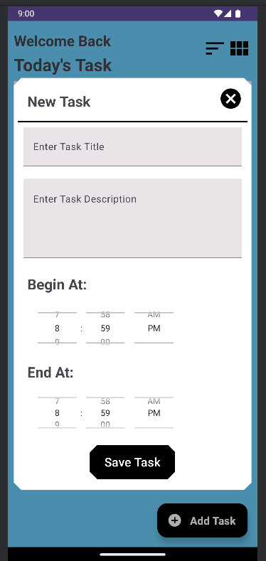
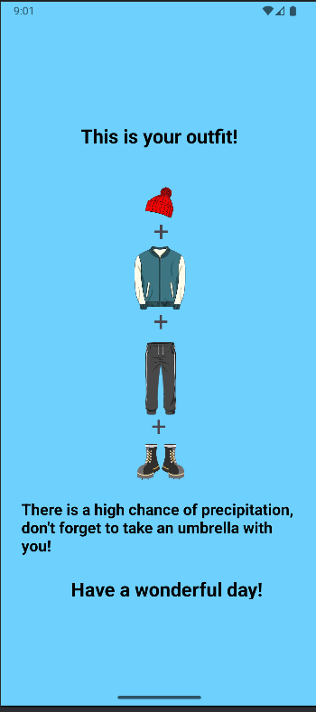

# __Outfit Helper__

## 📌 Overview

The **Outfit Helper App** is a mobile application that helps users choose the perfect outfit based on the weather forecast, their daily schedule, and available wardrobe items. By analyzing these inputs, the app provides personalized outfit suggestions to ensure comfort, style, and appropriateness for the day’s activities.

## 🚀 Features

- 🌦 **Weather-Based Recommendations** – Get outfit suggestions based on real-time weather forecasts.
- 📅 **Schedule Integration** – User can add and edit a schedule by adding/removing activities. The outfit recommendations are adjusted based on the users planned activities for the day.
- 👕 **Wardrobe Customization** – Allows users to upload their wardrobe items and personalize recommendations.
- 🔥 **Smart AI Suggestions** – Uses AI to mix and match outfits based on color coordination and style.(To be implemented)
- 📱 **User-Friendly Interface** – Simple and intuitive design for easy outfit selection.

## 🛠️ Tech Stack
- **Frontend/UI:** XML
- **Backend:** Kotlin / Room 
- **Weather API:** OpenWeather API
- **Database:** Room
- **Other tools:** Retrofit / Picasso / Lottie

## 📱Overview
  
  
  
  
  

